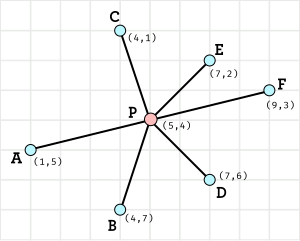

# Delaunay

[](https://coveralls.io/github/desicochrane/delaunay?branch=master)

Dependency-free implementation of the divide-and-conquer Delaunay Triangulation algorithm.

# Getting started

Install the package
`npm i @desicochrane/delaunay`

Import and triangulate your point set:

```js    
import Delaunay from '@desicochrane/delaunay'
// define your point set
const pts = [ [1,1], [1,2], [3,4], [4,5] ]

// compute triangulation graph
const graph = Delaunay(pts)
```

Here the output `graph` is an adjacency list, where the lists are doubly-linked and circular. To get the unique edges from this graph you can use the `UniqueEdges` helper:

```js    
import { UniqueEdges } from '@desicochrane/delaunay'

const edges = UniqueEdges(graph)
```

Where each edge is an array of two points.

# The Algorithm
This package takes a divide-and-conquer approach in the same flavor as merge-sort, the basic idea goes something like:

1. Sort the points left to right
1. Divide the points into halves until point set has size 2 or 3
1. Triangulate the 2 or 3 point sets manually
1. Merge the triangulations together


A sample code of the main routine would look something like this:

```js
// Delaunay.js

function Delaunay(pts) {
    // the output will be an adjacency list of edges
    const edges = {}
    
    // pass edges into the recursive procedure
    delaunay(edges, pts.sort(PointSort), 0, pts.length-1)
    
    return edges
}

function delaunay(edges, pts, min, max) {
    // how many points are we triangulating
    const size = max-min+1
    
    // zero or 1 point is the trivial delaunay triangulation 
    if (size < 2) return edges
    
    // 2 points can be computed easily
    if (size == 2) return Triangulate2(edges, pts[min], pts[max])
    
    // 3 points can be computed easily
    if (size == 3) return Triangulate3(edges, pts[min], pts[min+1], pts[max])
    
    // otherwise we divide into halves:
    const mid = min+((max-min)>>>1)
    
    delaunay(edges, pts, min, mid)
    delaunay(edges, pts, mid+1, max)
    
    // and then merge the results
    return Merge(adj, mid, mid+1)
}
```

What remains then is to specify the subroutines `PointSort`, `Triangulate2`, `Triangulate3`, and `Merge`.

### PointSort Subroutine

The algorithm assumes that the input points are sorted left-to-right and bottom-to-top, keeping in mind that browsers have the y-axis in the opposite direction (lower position is a higher y-coordinate).

So the following 10 points should be sorted as follows:

```txt
   D     F   I     |      4     6   9    
   C       G       |      3       7      
 A                 =>   1                
       E       J   |          5       10  
   B         H     |      2         8    
```        

The sort function then is as follows.

```js
// PointSort.js

export default function (A, B) {
    // if they share same x-coord
    if (A[0] === B[0]) {
        // then A comes before B iff A's y-coord is higher than B's y-coord
        return A[1] > B[1] ? -1 : 1
    }

    // otherwise A comes before B iff A's x-coord is lower than B's y-coord
    return A[0] < B[0] ? -1 : 1
}
```

### Triangulate2+3 Subroutines
```todo```

### Merge Subroutine
```todo```

# Geometry Prerequisites
The implementation depends on the following geometric concepts and properties:

### PseudoAngle
```todo```

### RightOf
```todo```

### Circumscribed
```todo```

### Convex Hull
```todo```

# What is a Delaunay Triangulation?

## Triangulation
```// todo Intuitions, counterexamples (crossing edges or incomplete), formal definition, examples, non-uniqueness and flipping edges```

## Delaunay Triangulation
```// todo compare min angles in two triangulations, prove intuitively existence and uniqueness via increasing via flipping argument, consequences (i.e. no circumscribed points, convex hull is a subset)```


# Data Structures
The efficiency depends heavily on being able to traverse the triangulation efficiently, to do so we construct a `Vertex Cycle` data structure which is effectively a specialised `Cyclic Linked List`.

### Cyclic Linked List
```todo```

### Vertex Cycle
The `VertexCycle` data structure is essentially a [cyclic and doubly linked list](#cyclic-linked-list), but augmented to maintain an additional sort invariant.

The vertex cycle takes a center point and then maintains the invariant that its the points that are inserted are sorted in in counter-clockwise direction relative to the center point. For example, consider the image below:



In the above picture, the vertex cycle is instantiated with the center point `P`, and guarantees that as the points `A` through `F` are inserted that they are sorted in counter clockwise order, that is `E` is after `F`, `C` is after `E`, `A` is after `C`, and so on.

For example, consider the following test case:

```js
// Given a center point P
const P = [5,4]

// and a new vertex cycle centered at P
const cycle = VertexCycle(P)

// when the following points are inserted (in arbitrary order)
const A = [1,5]
const B = [4,7]
const C = [4,1]
const D = [7,6]
const E = [7,2]
const F = [9,3]

cycle.Insert(A)
cycle.Insert(C)
cycle.Insert(E)
cycle.Insert(D)
cycle.Insert(F)
cycle.Insert(B)

// then they should be in counter-clockwise order from the first insert
expect(cycle.ToArray()).toEqual([A,B,D,F,E,C])
```

To maintain this counter-clockwise sort invariant an addition [pseudo-angle](#pseudoangle) is stored for each point along with a pointer to the item with the lowest pseudo-angle. Then when an item is inserted we can compute its pseudo-angle then traverse from the minimum item until we find a point with a higher pseudo-angle in which case we insert the new item before it (and update the minimum pointer if needed). When removing, we also need to check if the minimum pointer should be updated.

For full example see the source code for [VertexCycle](https://github.com/desicochrane/delaunay/blob/master/src/VertexCycle.js) and its [test cases](https://github.com/desicochrane/delaunay/blob/master/__tests__/VertexCycleTest.js).

### Adjacency List
```todo```
